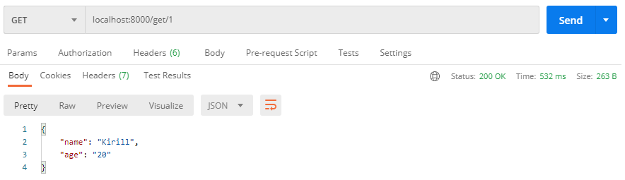
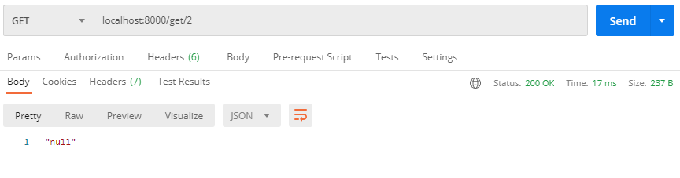
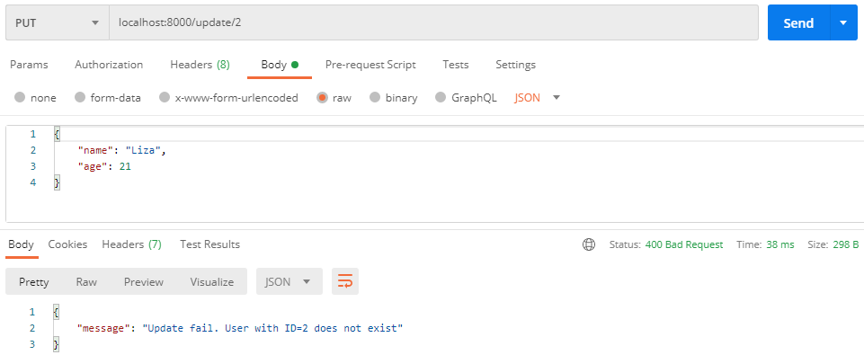
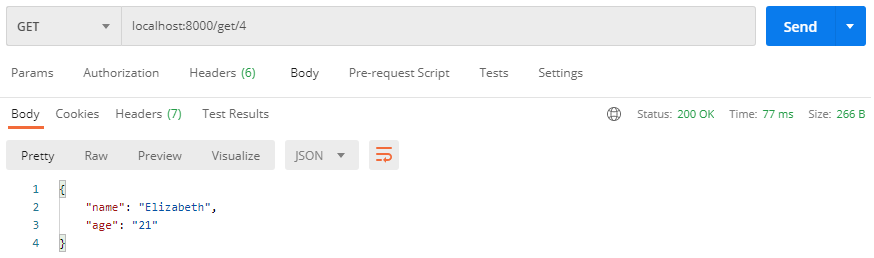

## Web-2020-Lab-3

### Requirements
- Python 3
- Django <br>
```python -m pip install Django```

### How to start
- Download code
- In the curent folder run the command: <br>
  ```python manage.py runserver```
  
 ### Example of work
 Two users have already been created in the database
 | ID  | Description | Age     |
 |:---:|    :----:   |  :---:  |
 | 1   | Kirill      |  20     |
 | 3   | Anton       |  20     |
 
 **1. Get existed user**
  
  <br><br>
 **2. Get not existed user**
  
  <br><br>
 **3. Create already existed user**
  
  <br><br>
 **4. Create new user**
  
  <br><br>
 **5. Update not existed user**
  
  <br><br>
 **6. Update (PUT) user**
  
  <br><br>
 **7. Update (PATCH) user**
  
  <br><br>
 **8. Get new (created and updated) user**
  
